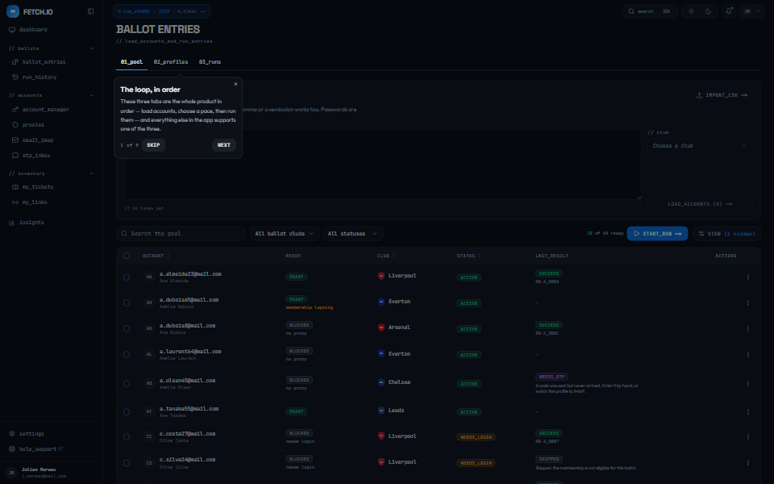
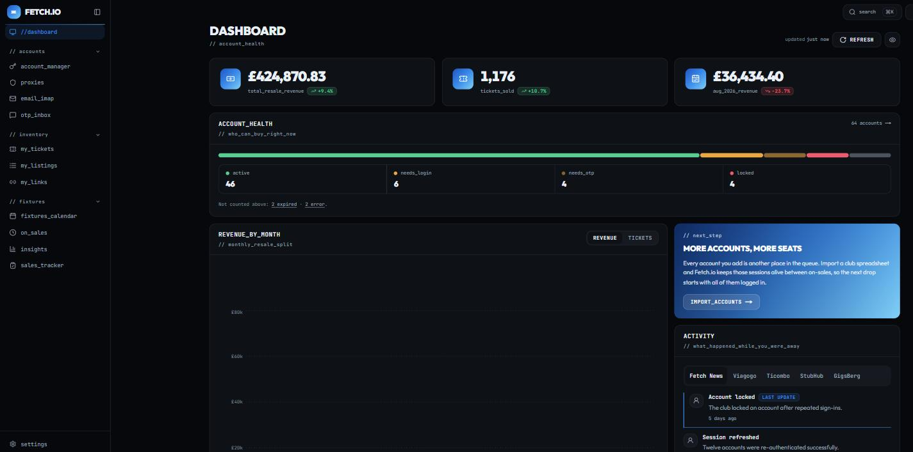
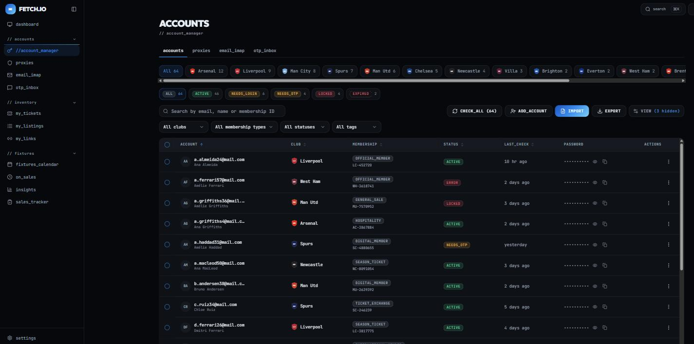
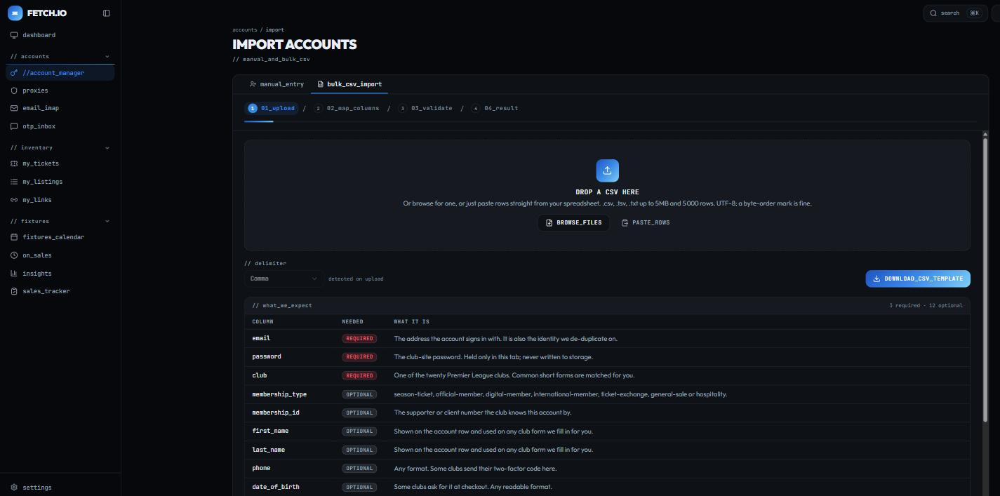
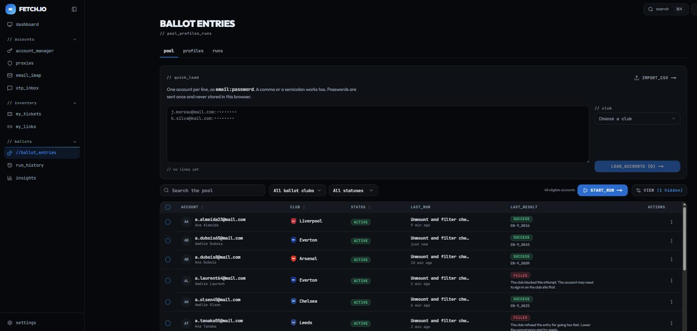
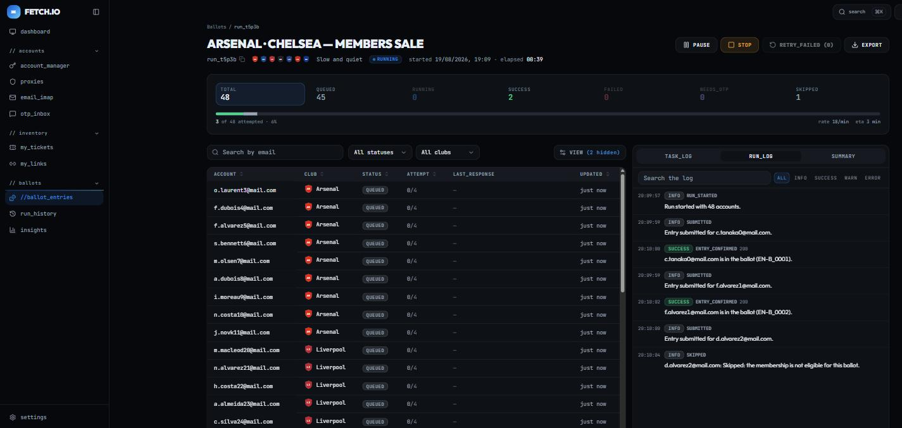
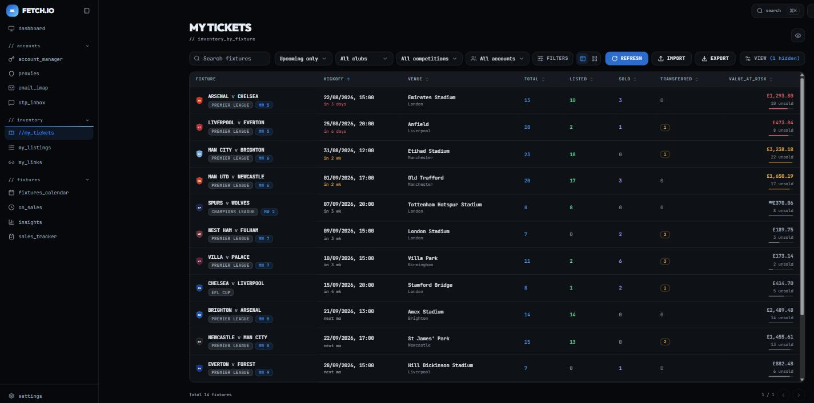
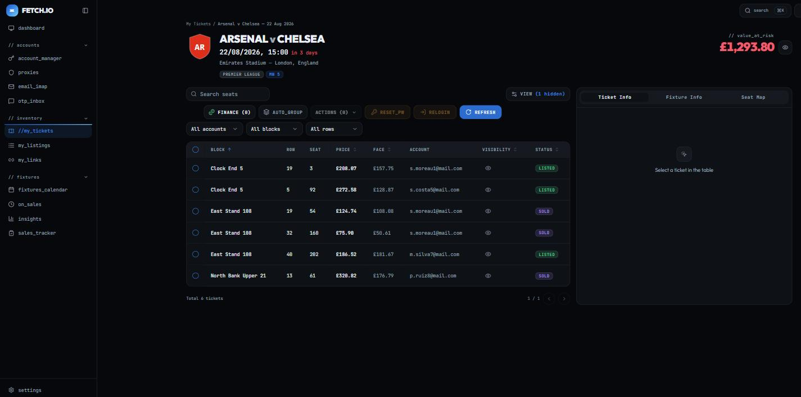

# Fetch.io

Fetch.io is the control room for someone who runs **many Premier League ticketing accounts**.

Club ticketing is membership-gated: every account is a membership with its own credentials, client
reference, loyalty points and eligibility window. A serious operator holds tens to hundreds of these
across clubs, and enters them into the club ballots that decide who gets to buy.

The app answers four questions, in order of how often they get asked:

| Question                                              | Screen                                     |
| ----------------------------------------------------- | ------------------------------------------ |
| Are my accounts healthy — logged in, unlocked, eligible? | `/accounts`                                |
| Did I get into the ballot?                            | `/ballots` → `/ballots/run/[id]`           |
| Did anything sell, and what am I exposed to?          | `/dashboard`                               |
| What do I own, per fixture?                           | `/mytickets` → `/mytickets/fixture/[id]`   |

**What works today:** every screen is built and driven by a seeded mock API — accounts with bulk
CSV import, per-fixture seat inventory with the full actions menu, a dashboard whose figures agree
with each other, the ballots module end to end (pool, profiles, launcher and a live run monitor),
settings that drive every date and price in the app, and a ⌘K palette over all of it.

**This repo is frontend only.** There is no backend. Every read and write goes through a typed,
Zod-validated API client whose base URL is a single environment variable, so a real backend can be
attached without touching a component — see
**[`docs/BACKEND-HANDOFF.md`](./docs/BACKEND-HANDOFF.md)**.

## The tour

A first-time visitor gets nine steps across the loop — the pool, the profiles, the launcher and a
run already in flight — starting once per browser on the dashboard, and available forever after from
the account menu or `⌘K → take_the_tour`. It reads the seeded run rather than starting one, so it
never causes a side effect.



## The screens

### `/dashboard` — did anything sell, and what am I exposed to
Three KPI tiles that agree with each other, account health at a glance, twelve months of revenue,
and the activity feed.



### `/accounts` — are my accounts healthy
Sixty-four memberships across twenty clubs, filterable by club, status, membership type and tag,
with masked credentials and per-row actions.



### `/accounts/import` — manual entry and bulk CSV
A four-step wizard: upload, map columns, validate and fix in place, import. Fuzzy club matching,
a downloadable error report, and passwords that never touch storage.



### `/ballots` — the pool, the profiles and the history
Three tabs. `// pool` loads accounts from a pasted `email:password` block or a CSV and shows the
seven ballot clubs' accounts with their last run and last result. `// profiles` is the CRUD for how
a run paces itself — concurrency, delays, retries, proxy group, OTP source. `// runs` is the
history, with active runs pinned to the top.



### `/ballots/run/[id]` — the live run monitor
The screen an operator watches for twenty minutes. Seven clickable counters over one progress bar
segmented by outcome, the task table on the left, and a persistent panel on the right holding the
selected task's timeline, the live tail and a breakdown by error code and club.

The run advances on **wall-clock time**, not a timer — the mock computes where a run should be from
`now - startedAt`, so progress survives a reload, leaks no intervals and replays identically. The
event log is a cursor feed: the client keeps `meta.lastSeq`, asks for `?since=<lastSeq>` and
appends. It never deduplicates, and every poll stops dead on a terminal status or an unmount.



### `/mytickets` — what do I own, per fixture
Every fixture you hold seats for, with listed / sold / transferred counts and the value still at
risk on each one.



### `/mytickets/fixture/[id]` — the seat-level screen
Two panes: every seat on the left, and whatever is selected explained on the right. The actions
menu groups, edits, transfers, downloads, makes public, shares and deletes.



Plus `/settings` (four tabs, and the one place preferences are written), two honest "coming soon"
pages, and `/kitchen-sink` — every component in every variant, in both themes.

## Running it

```bash
npm install
cp .env.example .env.local   # already present in a fresh clone of this working tree
npm run dev                  # http://localhost:3000
```

Other scripts:

| Script                 | What it does                                  |
| ---------------------- | --------------------------------------------- |
| `npm run dev`          | dev server (Turbopack)                        |
| `npm run build`        | production build                              |
| `npm run start`        | serve the production build                    |
| `npm run lint`         | ESLint                                        |
| `npm run typecheck`    | `tsc --noEmit`                                |
| `npm run format`       | Prettier write                                |
| `npm run format:check` | Prettier check, no writes                     |
| `npm run check`        | `lint` + `typecheck` + `check:contrast` — the quality gate |
| `npm run check:contrast` | WCAG contrast gate over the tokens in both themes |
| `npm run ui -- <name>` | add a shadcn/ui primitive into `components/ui` |

## Environment

```env
NEXT_PUBLIC_API_BASE_URL=/api/v1
MOCK_LATENCY_MS=400
```

`NEXT_PUBLIC_API_BASE_URL` is the seam. It defaults to `/api/v1`, served by mock route handlers in
`app/api/v1/**`. Point it at `https://api.fetch.io/v1` and the app talks to a real backend instead —
that one line is the only change required. `MOCK_LATENCY_MS` makes the mock routes sleep so skeleton
states are genuinely exercised; set it to `0` in tests.

## Stack

Next.js 15 (App Router) · TypeScript (strict) · Tailwind CSS v4 · shadcn/ui · TanStack Table ·
TanStack Query · TanStack Virtual · Recharts · Zod · next-themes · sonner · cmdk · papaparse.
Dark-first theme, with a fully correct light theme.

## The plan

Everything — brand tokens, data model, API contract, component inventory, screen specs, acceptance
criteria and the 12-part build order — lives in **[`FETCH-IO-BUILD-PLAN.md`](./FETCH-IO-BUILD-PLAN.md)**,
with the ballots module specified in **[`FETCH-IO-BALLOTS-SPEC.md`](./FETCH-IO-BALLOTS-SPEC.md)**.
Read them before adding anything. Every part is built; §11's and §B8's acceptance checklists are
green.

**The frontend automates nothing.** It creates a ballot run and reads its state. No request ever
goes to a club's site from this repository, no browser is driven, no proxy is held and no two-factor
code is read — all of that belongs to the backend, and
[`BACKEND-HANDOFF.md`](./docs/BACKEND-HANDOFF.md) says so in the terms a backend needs.

Also in `docs/`: [`BACKEND-HANDOFF.md`](./docs/BACKEND-HANDOFF.md) (what a real backend must get
right), [`API-CONTRACT.md`](./docs/API-CONTRACT.md) and [`openapi.json`](./docs/openapi.json) (the
wire format, generated from the Zod schemas), and
[`DESIGN-TOKENS.md`](./docs/DESIGN-TOKENS.md) (the palette and its contrast ledger).
